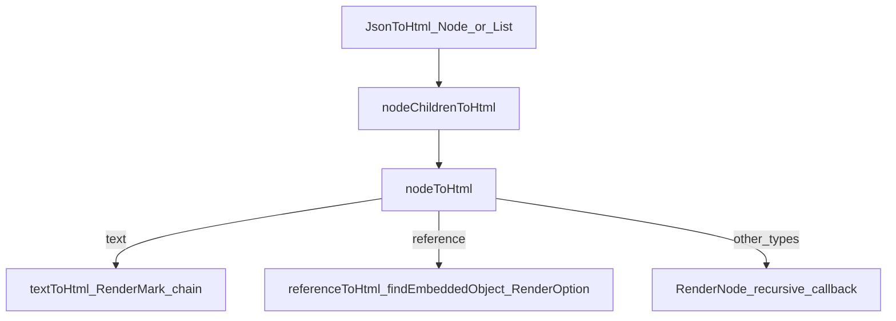
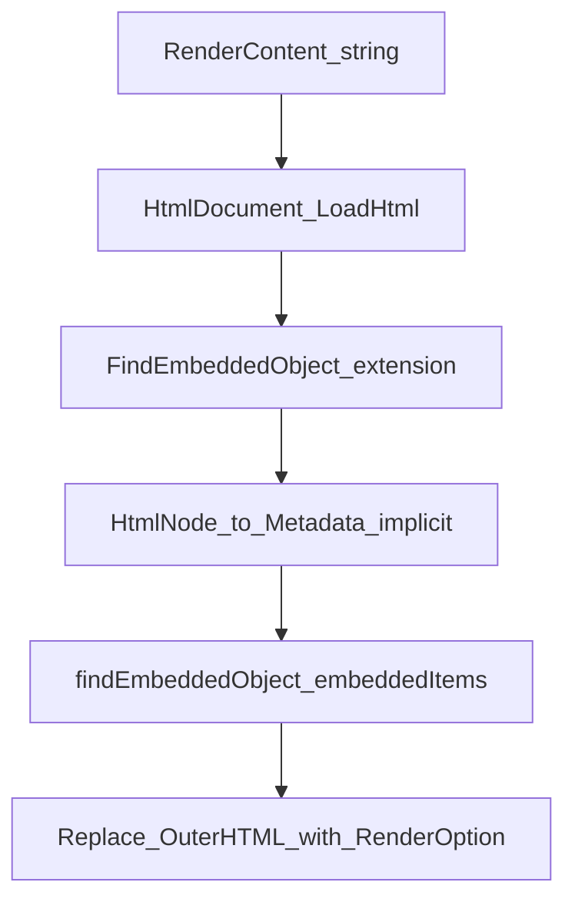

# Contentstack Utils (API) – Contentstack Utils .NET

## When to use

- Implementing or extending JSON RTE → HTML rendering or embedded content behavior.
- Adding node types, converters, or variant/metadata helpers.
- Choosing whether logic belongs in this package vs the Contentstack .NET Delivery SDK.

## Instructions

### Package and namespaces

- **NuGet package id:** `contentstack.utils` ([`Contentstack.Utils.csproj`](../../Contentstack.Utils/Contentstack.Utils.csproj)).
- **Root namespace:** `Contentstack.Utils`. Sub-namespaces follow folders: **`Contentstack.Utils.Models`**, **`Contentstack.Utils.Interfaces`**, **`Contentstack.Utils.Enums`**, **`Contentstack.Utils.Extensions`**, **`Contentstack.Utils.Converters`**.

### Models (library)

Source files under [`Contentstack.Utils/Models/`](../../Contentstack.Utils/Models/):

- [`JsonRTENode.cs`](../../Contentstack.Utils/Models/JsonRTENode.cs), [`JsonRTENodes.cs`](../../Contentstack.Utils/Models/JsonRTENodes.cs) — GQL-shaped RTE wrappers.
- [`Metadata.cs`](../../Contentstack.Utils/Models/Metadata.cs) — embed metadata; implicit conversions from **HtmlAgilityPack** `HtmlNode` and RTE `Node`.
- [`Node.cs`](../../Contentstack.Utils/Models/Node.cs), [`TextNode.cs`](../../Contentstack.Utils/Models/TextNode.cs) — RTE tree nodes.
- [`Options.cs`](../../Contentstack.Utils/Models/Options.cs) — default rendering; subclass for custom HTML.

### Interfaces (embedding and rendering)

- **`IEntryEmbedable`** — [`IEntryEmbedable.cs`](../../Contentstack.Utils/Interfaces/IEntryEmbedable.cs): `embeddedItems` map for resolving references.
- **`IEmbeddedObject`**, **`IEmbeddedEntry`**, **`EditableEntry`**, **`IEmbeddedAsset`** — [`IEmbeddedObject.cs`](../../Contentstack.Utils/Interfaces/IEmbeddedObject.cs).
- **`IRenderable`**, **`NodeChildrenCallBack`** — [`IOptions.cs`](../../Contentstack.Utils/Interfaces/IOptions.cs).
- **`IEdges<T>`** — [`IEdges.cs`](../../Contentstack.Utils/Interfaces/IEdges.cs) (GQL edge list). Spelling **`IEntryEmbedable`** matches the existing public API.

### Core type: `Contentstack.Utils.Utils`

[`Utils.cs`](../../Contentstack.Utils/Utils.cs) exposes static helpers including:

- **`JsonToHtml`**: Overloads for `Node`, `List<Node>` — see [Code flows](#code-flows).
- **`RenderContent`**: Overloads for `string` and `List<string>` HTML — see [Code flows](#code-flows).
- **`Utils.GQL`**: `JsonToHtml` for `JsonRTENode<T>` / `JsonRTENodes<T>` where `T : IEmbeddedObject` — see [Code flows](#code-flows).
- **`addEditableTags`**: Adds Live Preview–style **`data-cslp`** (or object-shaped) metadata on **`EditableEntry`** graphs for a given content type and locale (see [`Utils.addEditableTags`](../../Contentstack.Utils/Utils.cs)).
- **Variants / metadata:**
  - **`GetVariantAliases`** — reads each entry’s `publish_details` → `variants` object and collects non-empty **`alias`** values per variant entry (implementation: **`ExtractVariantAliasesFromEntry`** in [`Utils.cs`](../../Contentstack.Utils/Utils.cs), approx. lines 401–426).
  - **`GetVariantMetadataTags`** — wraps alias data into a **`JObject`** with key **`data-csvariants`** (compact JSON string).
  - **`GetDataCsvariantsAttribute`** — **Obsolete**; use **`GetVariantMetadataTags`** instead (same behavior; see XML comments on [`Utils`](../../Contentstack.Utils/Utils.cs)).

### Rendering hooks (`Options` / `IRenderable`)

Subclass or configure **[`Options.cs`](../../Contentstack.Utils/Models/Options.cs)** (`Options : IRenderable`) to override:

- **`RenderOption(IEmbeddedObject, Metadata)`**
- **`RenderNode(string nodeType, Node, NodeChildrenCallBack)`**
- **`RenderMark(MarkType, string text, string className, string Id)`**

### JSON serialization

- [`NodeJsonConverter.cs`](../../Contentstack.Utils/Converters/NodeJsonConverter.cs) and [`RTEJsonConverter.cs`](../../Contentstack.Utils/Converters/RTEJsonConverter.cs) integrate with **Newtonsoft.Json** for RTE node graphs. New node shapes should follow the same converter and model patterns.

### Dependencies

- **HtmlAgilityPack**: HTML load, query, and embedded-object replacement for `RenderContent`.
- **Newtonsoft.Json**: JSON models (`JObject`, `JArray`, converters). Upgrades should stay compatible with consumers and pass Snyk/CI.

### Out of scope

- This library **does not** ship an HTTP client for Contentstack Delivery or Management APIs. Apps typically use **Contentstack .NET SDK** (or REST) to fetch entries, then use **Utils** to render RTE HTML or process JSON. Keep HTTP, auth, and caching in application or SDK layers.

### Authoritative source

- **Signatures and full behavior** live in C# under [`Contentstack.Utils/`](../../Contentstack.Utils/). This skill summarizes; when in doubt, read the implementation (especially [`Utils.cs`](../../Contentstack.Utils/Utils.cs)).

## Code flows

Stepwise behavior with pointers into [`Utils.cs`](../../Contentstack.Utils/Utils.cs). Line numbers are approximate; verify against the file after large edits.

### RTE JSON → HTML (`JsonToHtml`)

1. **`JsonToHtml(Node, Options)`** (approx. lines 97–113) builds a **`referenceToHtml`** delegate: for **`reference`** nodes it calls **`findEmbeddedObject`** using **`options.entry.embeddedItems`**, then **`options.RenderOption`** when a match exists.
2. **`nodeChildrenToHtml`** (lines 115–118) concatenates HTML for each child via **`nodeToHtml`**.
3. **`nodeToHtml`** (lines 121–131): **`type == "text"`** → **`textToHtml`** (lines 133+), which applies marks in order via **`RenderMark`**; **`type == "reference"`** → **`referenceToHtml`**; **otherwise** → **`options.RenderNode`** with a callback that recurses into **`nodeChildrenToHtml`**.

### GQL RTE (`Utils.GQL.JsonToHtml`)

- Reuses **`nodeChildrenToHtml`** / **`nodeToHtml`**. **`referenceToHtml`** is built by **`GQL.refernceToHtml`** (lines 32–50): find **`IEdges<T>`** where **`edge.Node`** matches **`Metadata.ItemUid`** and **`ContentTypeUid`**, then **`options.RenderOption(edge.Node, metadata)`**. Entry points: **`GQL.JsonToHtml(JsonRTENode<T>, ...)`** (lines 17–20) and list overload (lines 22–30).

### HTML string with embeds (`RenderContent`)

1. **`RenderContent(string, Options)`** (lines 64–82): **`HtmlDocument.LoadHtml`**, then **`FindEmbeddedObject`** extension on [`HtmlDocumentExtension.cs`](../../Contentstack.Utils/Extensions/HtmlDocumentExtension.cs) (selects nodes with class **`embedded-asset`** or **`embedded-entry`**).
2. Each **HtmlNode** is passed to the callback; **`Metadata`** is produced via **implicit conversion** from **`HtmlNode`** ([`Metadata.cs`](../../Contentstack.Utils/Models/Metadata.cs), lines 46–68).
3. **`findEmbeddedObject`** resolves **`IEmbeddedObject`** from **`options.entry.embeddedItems`**; result string replaces **`metadata.OuterHTML`** in the accumulated HTML.

### Variant metadata (`GetVariantAliases` / `GetVariantMetadataTags`)

- **`ExtractVariantAliasesFromEntry`**: requires **`entry["publish_details"]`** as **`JObject`**, then **`publish_details["variants"]`** as **`JObject`**; for each property, reads **`alias`** from the nested object when present (lines 401–426).
- **`GetVariantMetadataTags`** builds **`{ "data-csvariants": <compact JSON string> }`** from **`GetVariantAliases`** results (lines 365–380).

### Diagrams (high level)

## References

- [`skills/csharp-style/SKILL.md`](../csharp-style/SKILL.md) — layout and naming in this repo.
- [`skills/testing/SKILL.md`](../testing/SKILL.md) — how to test API changes.
- [Product README](../../README.md) — install and usage examples.
- [Contentstack .NET Utils on NuGet](https://www.nuget.org/packages/contentstack.utils) — package listing (verify version).
